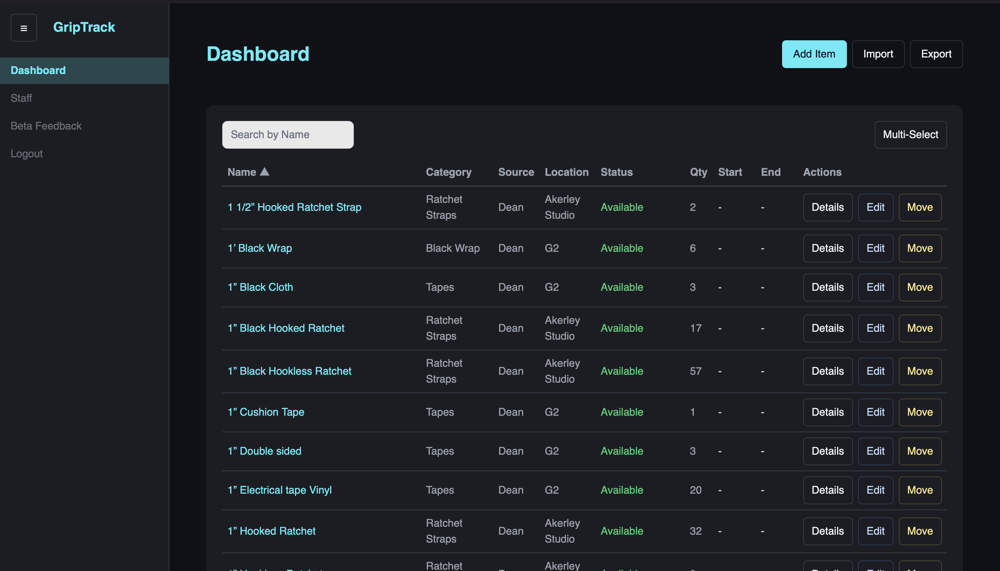
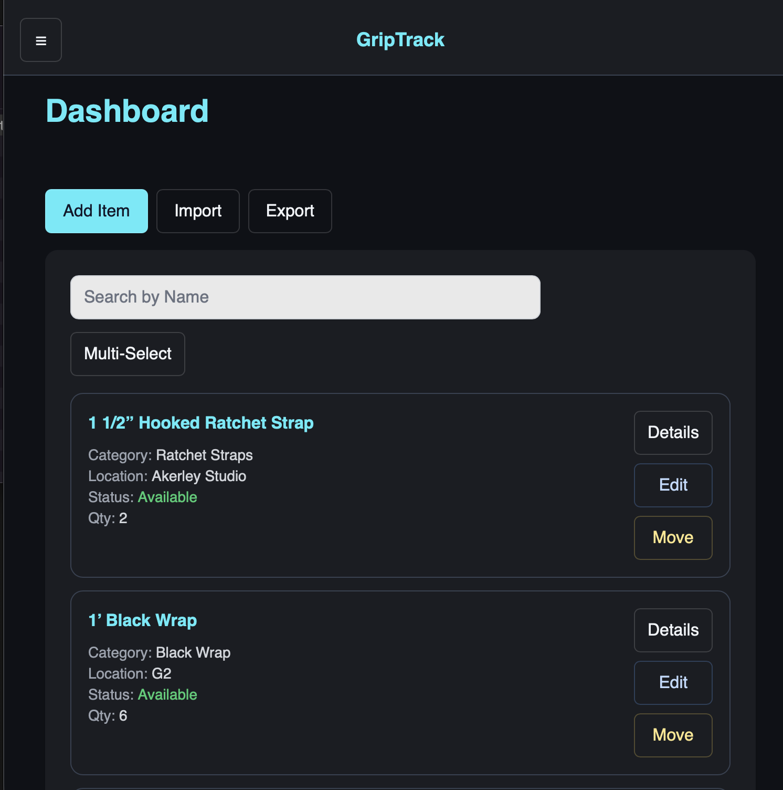
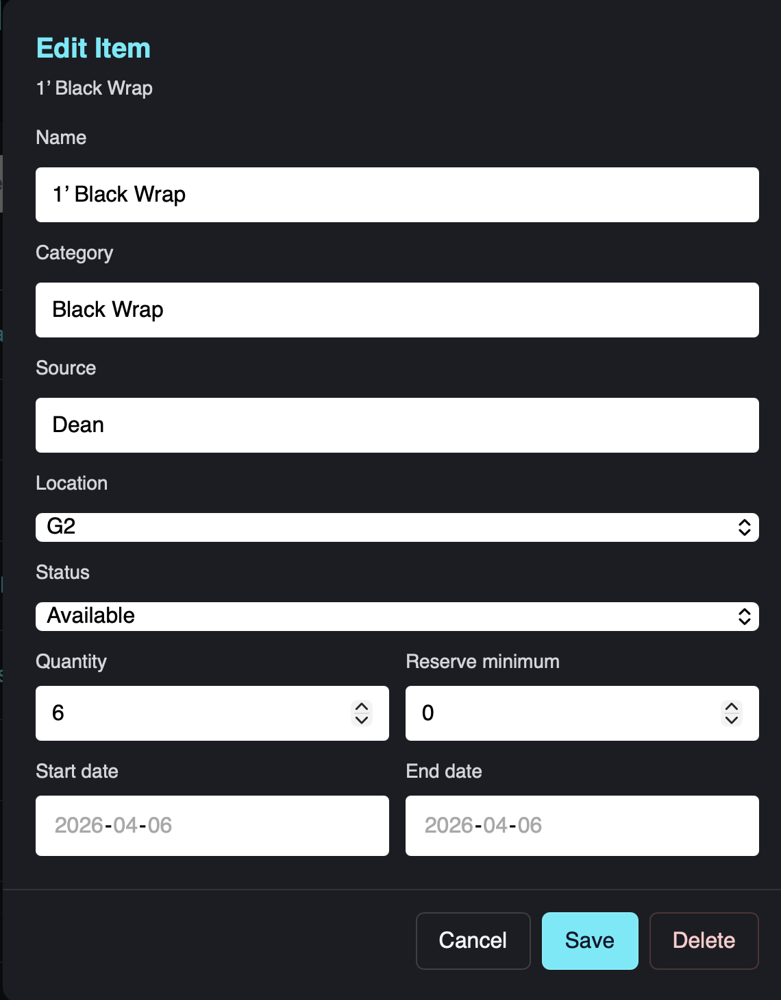

# GripTrack

GripTrack is a full-stack inventory management app built for film crews to track equipment across trucks, storage, and locations in real time.

It focuses on fast workflows, partial item movement, and handling the messy realities of production environments.

### Desktop View



### Mobile View



### Equipment Edit



---

## Overview

- Multi-tenant SaaS architecture
- Real-time inventory updates
- Organization-based access control (RLS)
- Designed for real production workflows

## Key Features

### Inventory Management

- Track equipment by:
  - Name
  - Category
  - Source (e.g., rental houses)
  - Location (truck, storage, etc.)
  - Status (Available, Out, Damaged, etc.)
  - Quantity
  - Rental start and end dates
- Automatic merging of items when returned to the same location with matching metadata
- Per-item update tracking (`updatedBy`)
- Prevents duplicate rows for identical item/location/state combinations

### Move and Split Logic

- Move partial quantities between locations
- Split inventory across multiple locations
- Automatically merges rows when items return to the same state
- Designed to reflect real production workflows rather than rigid inventory models

### PDF Import

- Upload rental PDFs and automatically parse inventory data
- Handles:
  - Grouped sections (Full / Partial / Unopened)
  - Inconsistent formatting and spacing
  - Indented sub-lines (ignored when appropriate)
- Designed to be resilient to real-world rental paperwork

### Export

- Export inventory to:
  - CSV
  - PDF (print-friendly)
- Export options:
  - All locations
  - Single or multiple locations
  - Current filtered/sorted view
- Intended for client offboarding and data ownership

### Mobile Support

- Card-based mobile layout
- Key information visible at a glance
- Details modal for extended fields
- Full support for editing, moving, and deleting items

### Bulk Actions

- Multi-select mode
- Bulk location updates
- Bulk deletion

### Feedback System

- Built-in feedback form for testers
- Submits bug reports and feature requests directly

---

## Authentication and Organizations

GripTrack is a multi-tenant system where users belong to organizations representing productions or companies.

### Roles

- **Owner**: Full control over the organization
- **Admin**: Can manage staff and send invites
- **Staff**: Standard operational access

### Features

- Email-based authentication (Supabase Auth)
- Invite system via email
- Organization-based data isolation using Row Level Security (RLS)
- Guided onboarding for new users

---

## Invite System

Admins and owners can invite staff via email.

### Flow

1. Admin sends an invite
2. User receives an email with a secure link
3. User signs in or creates an account
4. The system attaches the user to the organization
5. User completes profile setup and enters the dashboard

### Implementation

- Supabase Edge Functions for secure invite handling
- Resend SMTP for email delivery
- Postgres RPC (`accept_org_invite_for_user`) for transactional acceptance

---

## Tech Stack

- **Frontend**: React + Vite
- **Styling**: Tailwind CSS (custom design system)
- **Backend**: Supabase (Postgres, Auth, Edge Functions, RLS)
- **Email**: Resend (SMTP)
- **State Management**: React Context

---

## Project Structure (Key Areas)

```text
src/
├─ pages/
│  ├─ Auth.jsx
│  ├─ InviteAccept.jsx
│  ├─ Staff.jsx
│  ├─ OrgSetup.jsx
│  └─ dashboard/
│     ├─ DashboardPage.jsx
│     ├─ components/
│     ├─ hooks/
│     └─ utils/
├─ components/
│  ├─ layout/
│  ├─ feedback/
│  ├─ import/
│  └─ export/
├─ context/
│  ├─ UserProvider.jsx
│  └─ EquipmentContext.jsx
├─ lib/
│  └─ supabaseClient.js

supabase/
└─ functions/
   └─ invite-staff/

```

---

## Data Model

### Inventory Item

```json
{
  "id": "uuid",
  "itemId": "string | null",
  "name": "string",
  "category": "string",
  "source": "string",
  "location": "string",
  "status": "string",
  "quantity": "number",
  "rentalStart": "string | null",
  "rentalEnd": "string | null",
  "updatedBy": "string"
}
```

### Additional Tables

**organizations**

- id
- name

**organization_members**

- org_id
- user_id
- role
- status

**org_invites**

- email
- role
- status

**profiles**

- id (matches `auth.users.id`)
- email
- full_name

---

## Backend Architecture

GripTrack uses Supabase as a backend platform.

### Key Capabilities

- Row Level Security (RLS) for multi-tenant data isolation
- Edge Functions for secure server-side operations
- Postgres RPC for transactional workflows

### Core Systems

- `invite-staff` (Edge Function)
- `accept_org_invite_for_user()` (RPC)

All sensitive operations such as invites, role changes, and membership updates are enforced at the database level.

---

## Design System

All UI elements use shared Tailwind-based classes defined in `index.css`.

### Button Classes

- `btn-accent`
- `btn-secondary`
- `btn-danger`
- `btn-disabled`

### Text Classes

- `text-text` - default
- `text-accent` - highlights
- `text-success` - available
- `text-warning` - out/upcoming
- `text-danger` - overdue/damaged

Direct color usage in components is avoided in favor of consistent design tokens.

---

## Local Development

```bash
npm install
npm run dev
```

App runs at:

```
http://localhost:5173
```

---

## Project Philosophy

- Real-world workflows over idealized data models
- Desktop efficiency over mobile completeness
- Clarity over cleverness
- Modals over browser-native confirms
- Data integrity over visual polish

GripTrack is designed to handle messy inputs, rapid workflows, and human error typical of film production environments.

---

## Status

GripTrack is currently in active development with real-world testing and ongoing feature expansion.
